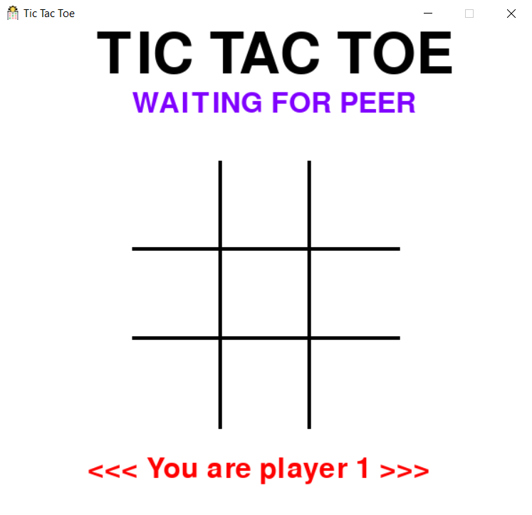
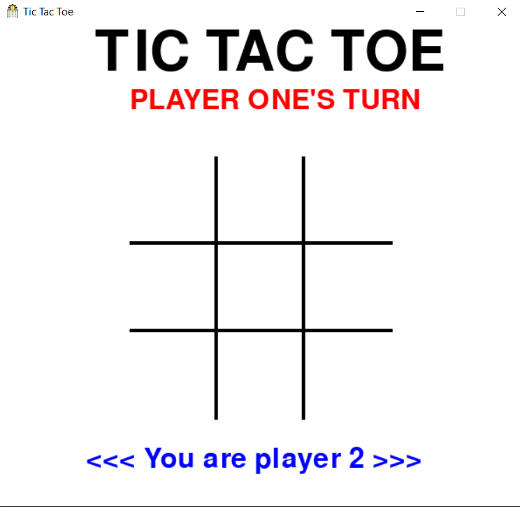
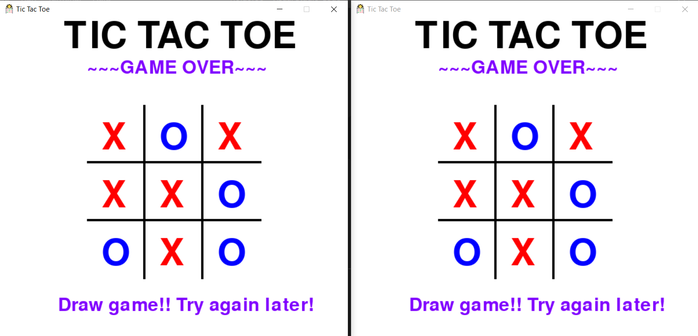

# Tic-Tac-Toe
- Tic Tac Toe game with socket programming and pygame.
- It can be played over a network!

## Installing Packages
- Install the following package dependencies using pip:
```ps
pip install pygame
```

---

## How to Play?
- Clone the Repository
```
git clone https://github.com/DhilipSanjay/Tic-Tac-Toe.git
```
- Move to the Directory `04 TicTacToe - Socket + Pygame`
```
cd "Tic-Tac-Toe\04 TicTacToe - Socket + Pygame"
```
- Start the Server
```
python server.py
```
- Start two players and enter the IP address. If both the players are on same host, use the loopback IP `127.0.0.1` or `localhost`.
    - Player 1
    ```
    python player.py
    pygame 1.9.6
    Hello from the pygame community. https://www.pygame.org/contribute.html
    Enter the server IP:localhost
    Connected to : localhost : 9999
    ```

    - Player 2
    ```
    python player.py
    pygame 1.9.6
    Hello from the pygame community. https://www.pygame.org/contribute.html
    Enter the server IP:127.0.0.1
    Connected to : 127.0.0.1 : 9999
    ```
- Now you can start playing Tic Tac Toe over a network.

---

## Screenshots
Player 1         |  Player 2
:-------------------------:|:-------------------------:
 | 

### Player 1 Wins


### Player 2 Wins


### Draw Game


---

### Note
Feel free to play the other versions of Tic Tac Toe in this repo *(on Terminal, on Terminal with Socket)*.

---
